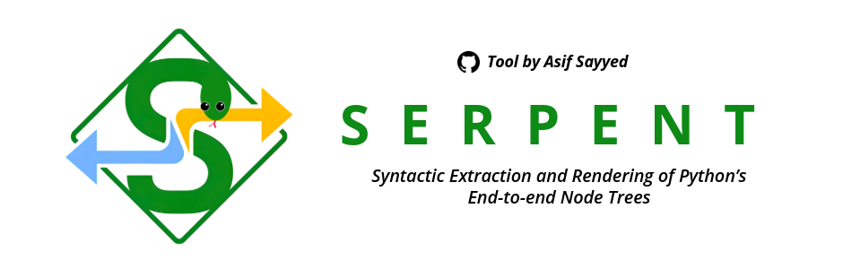

# SERPENT

*Syntactic Extraction and Rendering of Python’s End-to-end Node Trees*


[](https://badge.fury.io/py/serpent-flowchart)
[](https://serpent.streamlit.app)



---

## Table of Contents

- [Overview](#overview)
- [Features and Example](#features--examples)
- [Getting Started](#getting-started)
  - [Prerequisites](#prerequisites)
  - [Installation](#installation)
- [Development](#development)
  - [Running the Linter](#running-the-linter)
- [Results](#results)
- [Conclusion](#conclusion)
- [License](#license)

---

## Overview

SERPENT is an offline Python flowchart generator. It reads any valid Python code, parses its Abstract Syntax Tree (AST), and converts it into a clear, standard flowchart diagram.

**Now available as a Python package!** You can use it in your Jupyter Notebooks to instantly visualize functions and code snippets.

---

## Features & Examples

SERPENT can handle a variety of Python structures. Here are a few examples of how it visualizes a programmer's daily struggles.

### 1. A Programmer's Motivation Engine ☕

**Python Code:**
```python
def should_i_code_today(coffee_level, deadline_approaching):
    if deadline_approaching:
        return "Code like your life depends on it!"
    elif coffee_level > 5:
        return "Let's write some beautiful, elegant code."
    else:
        return "Go get more coffee, then we'll talk."
```

**Generated Flowchart:**


### 2. The Classic Bug-Fixing Loop 🐛

**Python Code:**
```python
def fix_bugs(bugs_remaining):
    while bugs_remaining > 0:
        print(f"{bugs_remaining} little bugs in the code...")
        bugs_remaining -= 1
        print("Take one down, patch it around...")
        bugs_remaining += 2 # Oh no, two new bugs appeared!
    print("No more bugs in the code!")
```

**Generated Flowchart:**


## Getting Started

### 1. Install Prerequisites

**System Dependency**: You must have `Graphviz` installed on your system.
- **Windows**: [Download Installer](https://graphviz.org/download/) (Select "Add Graphviz to the system PATH" during installation)
- **macOS**: `brew install graphviz`
- **Linux**: `sudo apt install graphviz`

### 2. Install the Package

To use SERPENT in your Python scripts or Jupyter Notebooks:
```bash
pip install serpent-flowchart
```

To run the Streamlit Web App locally:
```bash
pip install serpent-flowchart[app]
```

## Usage

### In Jupyter Notebooks 📓

Use the `serpentify` function to visualize your code instantly.

```python
from serpent import serpentify

def is_positive(x):
    if x > 0:
        return "Yes"
    else:
        return "No"

# Visualizes the function directly!
serpentify(is_positive, title="Positive Check")
```

### Running the Web App 🌐

If you installed with the `[app]` extra, you can launch the GUI:
```bash
streamlit run serpent/app.py
# Note: You might need to clone the repo to run app.py directly if it's not exposed as a CLI entry point yet.
```
*Alternatively, clone the repo and use Poetry as described below for development.*

---

## Development

This project uses modern Python tooling to ensure code quality and consistency. After installing the development dependencies, you can use the following tools.

### Running the Linter

To check the code for style violations and potential errors, run Flake8 from the project root:
```bash
flake8 .
```

## Results
The project successfully generates Python flowcharts offline. It handles conditional branches, loops, and nested logic, and produces standard flowchart shapes with clean arrows. The tool supports visual clarity, and users can export the diagrams for reports or presentations.

## Conclusion
SERPENT makes reading, explaining, and reviewing Python code easier for developers, students, educators, and teams. By visualising code structure without any online dependencies, it keeps source code secure while improving collaboration and understanding.

## License

This project is licensed under the MIT License, see the [LICENSE](./LICENSE) file for details.
