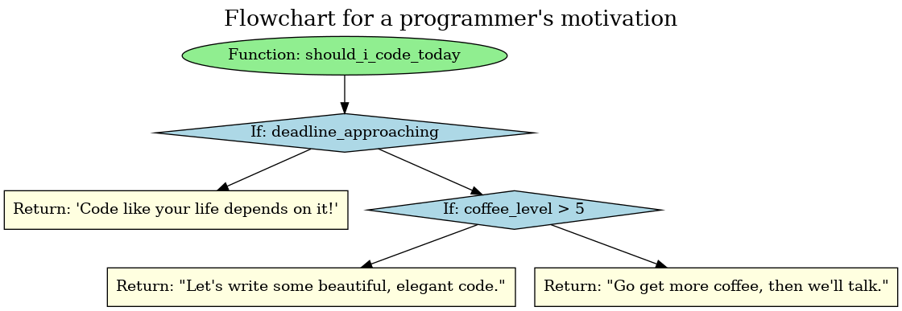
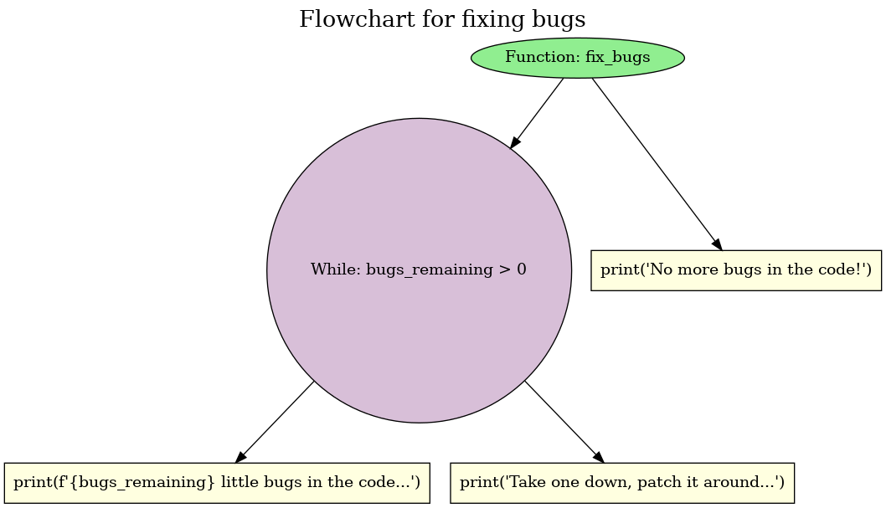

# SERPENT

*Syntactic Extraction and Rendering of Python’s End-to-end Node Trees*


[](https://serpent.streamlit.app)

---

## Table of Contents

- [Overview](#overview)
- [Feature and Example](#features--examples)
- [Getting Started](#getting-started)
  - [Prerequisites](#prerequisites)
  - [Installation](#installation)
- [Development](#development)
  - [Running the Linter](#running-the-linter)
- [Results](#results)
- [Conclusion](#conclusion)
- [License](#license)

---

## Overview

SERPENT is an offline Python flowchart generator. It reads any valid Python code, parses its Abstract Syntax Tree (AST), and converts it into a clear, standard flowchart diagram. This makes it easier to explain, review, and share Python code structure, especially for people who prefer visual formats over raw code. It is designed to work fully offline, without sending any data to online tools or services.

---

## Features & Examples

SERPENT can handle a variety of Python structures. Here are a few examples of how it visualizes a programmer's daily struggles.

### 1. A Programmer's Motivation Engine ☕

**Python Code:**
```python
def should_i_code_today(coffee_level, deadline_approaching):
    if deadline_approaching:
        return "Code like your life depends on it!"
    elif coffee_level > 5:
        return "Let's write some beautiful, elegant code."
    else:
        return "Go get more coffee, then we'll talk."
```

**Generated Flowchart:**


### 2. The Classic Bug-Fixing Loop 🐛

**Python Code:**
```python
def fix_bugs(bugs_remaining):
    while bugs_remaining > 0:
        print(f"{bugs_remaining} little bugs in the code...")
        bugs_remaining -= 1
        print("Take one down, patch it around...")
        bugs_remaining += 2 # Oh no, two new bugs appeared!
    print("No more bugs in the code!")
```

**Generated Flowchart:**


## Getting Started

### Prerequisites
`Python 3.8` or above installed on your local machine. I've made it on `Python 3.13.5` to be precise.

### Installation

1.  Clone the repository:
    ```bash
    git clone https://github.com/Asifdotexe/SERPENT.git
    cd SERPENT
    ```

2.  Create and activate a virtual environment (recommended):
    ```bash
    # Create the environment
    python -m venv venv

    # Activate on Linux/macOS
    source venv/bin/activate

    # Activate on Windows
    venv\Scripts\activate
    ```

3.  Install all dependencies from `pyproject.toml`:
    ```bash
    # Install core app for production
    pip install .

    # Installs core app and development tools in editable mode
    pip install -e .[dev]
    ```

4.  Run the Streamlit app:
    ```bash
    streamlit run serpent.py
    ```

---

## Development

This project uses modern Python tooling to ensure code quality and consistency. After installing the development dependencies, you can use the following tools.

### Running the Linter

To check the code for style violations and potential errors, run Flake8 from the project root:
```bash
flake8 .
```

## Results
The project successfully generates Python flowcharts offline. It handles conditional branches, loops, and nested logic, and produces standard flowchart shapes with clean arrows. The tool supports visual clarity, and users can export the diagrams for reports or presentations.

## Conclusion
SERPENT makes reading, explaining, and reviewing Python code easier for developers, students, educators, and teams. By visualising code structure without any online dependencies, it keeps source code secure while improving collaboration and understanding.

## License

This project is licensed under the MIT License, see the [LICENSE](./LICENSE) file for details.
